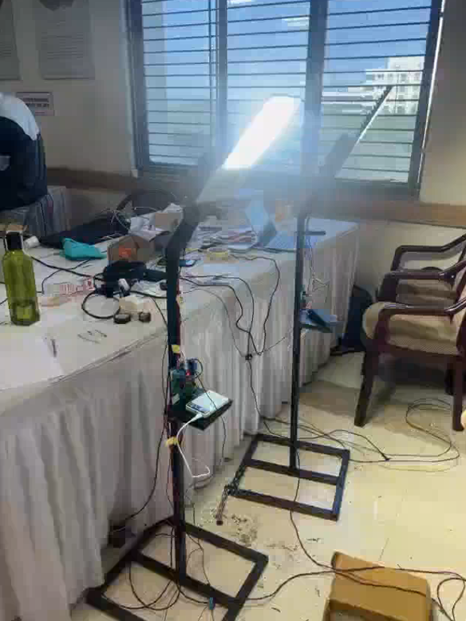
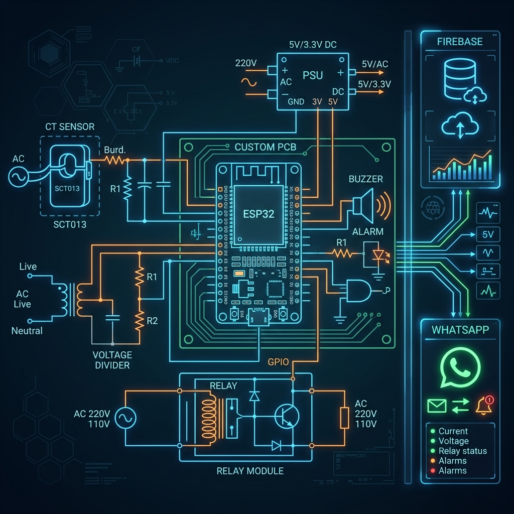
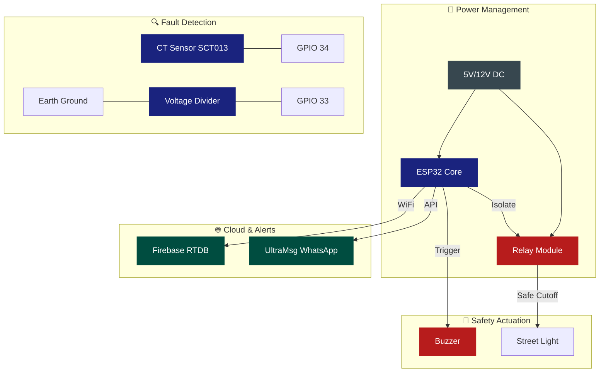

# ⚡ Smart Pole Fault Detection System

<p align="center">
  
  
  
  
</p>

---

## 🏆 SIH 2024 Hardware Edition Highlights

The Smart Pole Fault Detection System was demonstrated at the **Smart India Hackathon 2024 Grand Finale (Hardware Edition)**.

<p align="center">
  
  
  <br>
  <i>Left: Hardware prototype demonstration. Right: Team interaction with the Grand Finale Jury.</i>
</p>

<p align="center">
  
  <br>
  <i>The core development team at the SIH 2024 Grand Finale.</i>
</p>

---

## 📖 Overview

The **Smart Pole Fault Detection System** is a mission-critical IoT solution designed to safeguard urban electrical infrastructure. By monitoring leakage current and earthing resistance in real-time, it prevents hazards such as electric shocks and electrical fires.

### 🌟 Core Capabilities
- 🛡️ **Autonomous Safety**: Immediate power isolation via relays when critical faults occur.
- 📡 **Instant Alerts**: WhatsApp notifications delivered directly to maintenance teams.
- 📊 **Live Monitoring**: Real-time data logging to Firebase for historical analysis.
- ⚙️ **Modular Design**: Highly scalable architecture for easy sensor expansion.

---

## 🔌 Circuit Architecture

### 🛠️ Hardware Visualization
<p align="center">
  
  <br>
  <i>Conceptual visualization of the Smart Pole sensing and control nodes.</i>
</p>

### 📐 Logical Connections


### 📍 Pin Mapping Table

| Component | Pin | Function | Logic |
| :--- | :--- | :--- | :--- |
| **CT Sensor** | `GPIO 34` | Analog Input | Current Measurement |
| **Earthing Divider** | `GPIO 33` | Analog Input | Resistance Calculation |
| **System Alarm** | `GPIO 18` | Digital Output | Active HIGH on Fault |
| **Power Relay** | `GPIO 27` | Digital Output | Active HIGH to Isolate |

---

## 🏗️ Modular Software Design

This firmware is built for **scalability**. Instead of a monolithic block, it uses a manager-based architecture:

1.  **`SensorManager`**: Handles all analog/digital sensing operations.
2.  **`CommManager`**: Abstracts WiFi, Firebase, and API protocols.
3.  **`SafetySystem`**: Controls the finite state machine for safety interlocks.
4.  **`Config`**: Single point of entry for credentials and hardware pins.

---

## 🔧 Installation & Setup

1.  **Clone & Initialize**
    ```bash
    git clone https://github.com/laksh890/Street_Light_Pole_Earthing_and_Leakage_Protection_System.git
    cd Street_Light_Pole_Earthing_and_Leakage_Protection_System
    ```
2.  **Configure Secrets**
    - Copy `include/config.h.example` to `include/config.h`.
    - Populate your WiFi and API credentials.
3.  **Deploy**
    - Open the project in **VS Code** with **PlatformIO**.
    - Hit `Build` and then `Upload`.

---

## 👨‍💻 Author

**Lakshay Gandotra**  
*Electrical Engineering, NIT Srinagar*  
[Connect on GitHub](https://github.com/laksh890)

---

## ⚖️ License

Distributed under the MIT License. See `LICENSE` for more information.